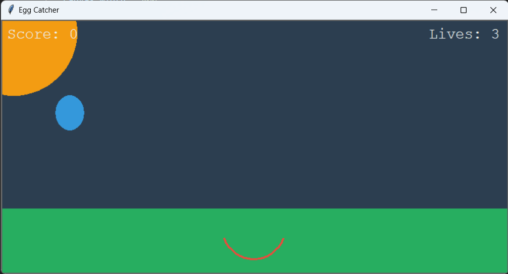

# Egg Catcher Game

Egg Catcher is a simple, yet engaging game created using Python's `tkinter` module. The player's goal is to catch the falling eggs using a catcher. The game ends when a player loses all their lives.

## Details

The game was developed using Python and relies on the following modules:

- `itertools` (Standard Library)
- `random` (Standard Library)
- `tkinter` (Standard GUI library for Python, comes pre-installed with most Python installations)

### Features

- Beautiful modern graphics using vibrant colors.
- Dynamic difficulty scaling. As your score increases, the game gets faster!
- Live score and lives counter.
- Smooth movement controls for the catcher.
- Option to replay after the game ends.

## Getting Started

1. Ensure Python is installed on your machine.
2. Check if `tkinter` is available by trying to import it in a Python shell. If not, install it as per your operating system's requirements.
3. Clone the repository: `git clone https://github.com/Bisalkumar/Egg_Catcher_Game.git`
4. Navigate to the directory and run the game: `python game.py`

## How to Use

- Use the left and right arrow keys to move the catcher.
- Try to catch as many eggs as possible without missing them!
- The game ends when you miss three eggs. You can choose to replay or close the game.

## Screenshots

## Contributions

Contributions, bug reports, and fixes are welcome. Please open an issue if you find a bug or have a feature request.

## License

This project is licensed under the MIT License - see the [LICENSE.md](LICENSE.md) file for details.

## Acknowledgement

Thanks to the Python community for their continuous support and to google for guidance on game logic and improvements.

